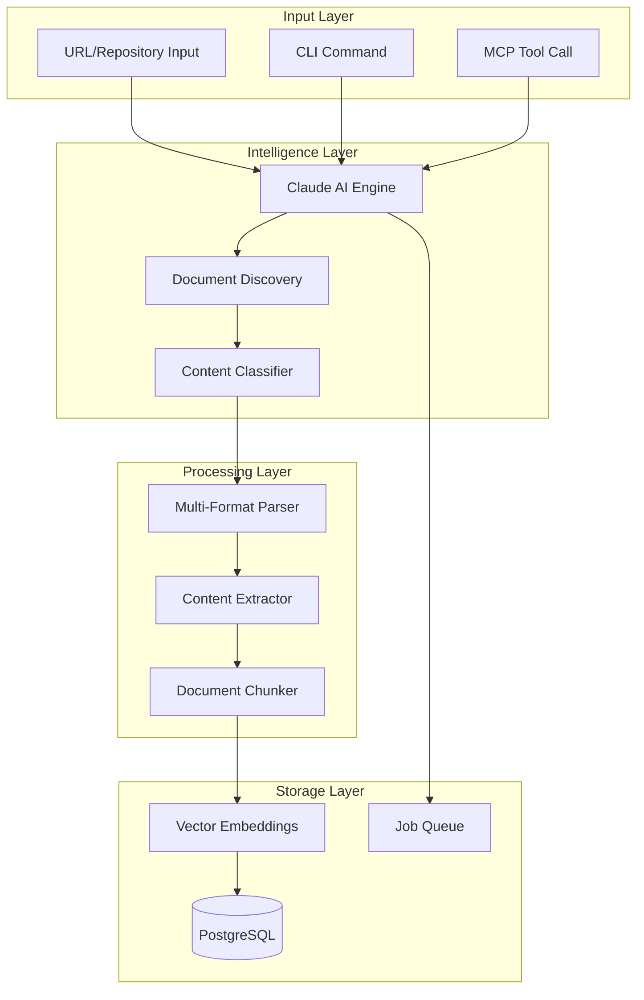

# Intelligent Documentation Ingestion Implementation Plan

## Executive Summary

Build an intelligent, URL-based documentation ingestion system that leverages AI (Claude) to automatically identify, extract, and process relevant documentation from various sources. The system will support multiple documentation types and provide both CLI and MCP server interfaces for seamless integration.

---

## 🎯 **Goals & Objectives**

1. **Eliminate manual edge-case coding** for different documentation sources
2. **Leverage AI intelligence** to determine what documents to ingest
3. **Support multiple source types** (GitHub repos, websites, APIs, etc.)
4. **Provide streamlined CLI tooling** for easy ingestion
5. **Create MCP server integration** for automated ingestion via tool calls

---

## 📋 **Current State Analysis**

### Existing Infrastructure
- ✅ **Database schema** for documents with embeddings
- ✅ **Loader framework** with `RustLoader` as example
- ✅ **Migration system** for batch processing
- ✅ **MCP tools** for crate management (add/remove/list)
- ✅ **Rate limiting** for HTTP requests
- ✅ **Job queue system** for async processing

### Gaps to Fill
- ❌ Generic URL/GitHub repository ingestion
- ❌ AI-powered document discovery
- ❌ Multi-format parsing (beyond HTML)
- ❌ CLI commands for direct ingestion
- ❌ Intelligent content extraction

---

## 🏗️ **Architecture Design**

### Component Overview



---

## 📦 **Implementation Phases**

### Phase 1: Intelligent Document Discovery Module
**Timeline: Week 1-2**

#### 1.1 Create `IntelligentLoader` trait
```rust
// loader/src/intelligent.rs
pub trait IntelligentLoader {
    async fn discover_documents(&self, url: &str) -> Result<Vec<DocumentSource>>;
    async fn classify_content(&self, content: &str) -> Result<DocumentType>;
    async fn extract_relevant(&self, source: DocumentSource) -> Result<Vec<Document>>;
}
```

#### 1.2 Implement Claude-powered discovery
```rust
pub struct ClaudeIntelligentLoader {
    llm_client: LLMClient,
    rate_limiter: RateLimiter,
}

impl ClaudeIntelligentLoader {
    async fn analyze_repository(&self, repo_url: &str) -> Result<AnalysisResult> {
        // Use Claude to:
        // 1. Identify documentation patterns
        // 2. Find README, docs/, wiki, etc.
        // 3. Determine relevant code files
        // 4. Suggest ingestion strategy
    }
}
```

#### 1.3 Document source types
```rust
pub enum DocumentSource {
    GitHubRepo { owner: String, repo: String },
    GitHubFile { url: String, path: String },
    WebPage { url: String },
    ApiDocs { base_url: String, spec_url: Option<String> },
    LocalFile { path: PathBuf },
    RawMarkdown { content: String, source: String },
}
```

---

### Phase 2: Multi-Format Parser Enhancement
**Timeline: Week 2-3**

#### 2.1 Extend parser capabilities
```rust
// loader/src/parsers.rs
pub struct UniversalParser {
    markdown_parser: MarkdownParser,
    html_parser: HtmlParser,
    code_parser: CodeParser,
    pdf_parser: PdfParser,
    json_parser: JsonParser,
}

impl UniversalParser {
    pub async fn parse(&self, source: DocumentSource) -> Result<ParsedContent> {
        match self.detect_format(&source).await? {
            Format::Markdown => self.markdown_parser.parse(source),
            Format::Html => self.html_parser.parse(source),
            Format::Code => self.code_parser.parse(source),
            // ... etc
        }
    }
}
```

#### 2.2 GitHub-specific extractor
```rust
pub struct GitHubExtractor {
    client: octocrab::Octocrab,
    rate_limiter: RateLimiter,
}

impl GitHubExtractor {
    pub async fn extract_repo_docs(&self, owner: &str, repo: &str) -> Result<Vec<Document>> {
        // 1. Fetch repository structure
        // 2. Identify documentation files
        // 3. Extract README, docs/, wiki
        // 4. Parse code comments if relevant
    }
}
```

---

### Phase 3: CLI Command Implementation
**Timeline: Week 3-4**

#### 3.1 Add ingestion commands
```bash
# Direct ingestion commands
cargo run --bin doc-ingest -- \
    --url "https://github.com/talos-systems/talos" \
    --type "talos" \
    --intelligent

# Batch ingestion from file
cargo run --bin doc-ingest -- \
    --batch urls.txt \
    --parallel 4

# Interactive mode with AI assistance
cargo run --bin doc-ingest -- \
    --interactive \
    --ai-guided
```

#### 3.2 CLI structure
```rust
// loader/src/bin/ingest.rs
#[derive(Parser)]
struct IngestArgs {
    /// URL or repository to ingest
    #[arg(long)]
    url: Option<String>,
    
    /// Documentation type
    #[arg(long)]
    doc_type: Option<String>,
    
    /// Use AI for intelligent discovery
    #[arg(long)]
    intelligent: bool,
    
    /// Batch file with URLs
    #[arg(long)]
    batch: Option<PathBuf>,
    
    /// Interactive mode
    #[arg(long)]
    interactive: bool,
}
```

---

### Phase 4: MCP Server Tool Integration
**Timeline: Week 4-5**

#### 4.1 Create ingestion tool
```rust
// mcp/src/ingestion_tools.rs
pub struct IngestDocumentationTool {
    intelligent_loader: Arc<ClaudeIntelligentLoader>,
    job_processor: JobProcessor,
    db_pool: DatabasePool,
}

impl Tool for IngestDocumentationTool {
    fn definition(&self) -> Value {
        json!({
            "name": "ingest_documentation",
            "description": "Intelligently ingest documentation from any URL or repository",
            "inputSchema": {
                "type": "object",
                "properties": {
                    "url": {
                        "type": "string",
                        "description": "URL of repository, website, or documentation"
                    },
                    "doc_type": {
                        "type": "string",
                        "description": "Type of documentation (optional, will be auto-detected)"
                    },
                    "options": {
                        "type": "object",
                        "properties": {
                            "depth": { "type": "integer" },
                            "include_code": { "type": "boolean" },
                            "include_examples": { "type": "boolean" }
                        }
                    }
                }
            }
        })
    }
}
```

#### 4.2 Batch ingestion tool
```rust
pub struct BatchIngestTool {
    // Support for ingesting missing documentation types
    async fn ingest_missing_docs(&self) -> Result<Value> {
        let missing = vec![
            ("talos", "https://github.com/talos-systems/talos"),
            ("ebpf", "https://github.com/iovisor/bcc"),
            ("cilium", "https://github.com/cilium/cilium"),
            // ... etc
        ];
        
        for (doc_type, url) in missing {
            self.queue_ingestion_job(url, doc_type).await?;
        }
    }
}
```

---

## 🔧 **Technical Implementation Details**

### AI Integration Strategy

#### Claude Prompts for Discovery
```rust
const DISCOVERY_PROMPT: &str = r#"
Analyze this repository/URL and identify all relevant documentation:
- README files
- Documentation directories
- API specifications
- Code examples
- Configuration guides
- Architecture documents

Repository: {url}
Structure: {tree}

Return a structured list of documents to ingest with priority scores.
"#;

const CLASSIFICATION_PROMPT: &str = r#"
Classify this content and determine the best parsing strategy:
- Document type (markdown, API spec, guide, reference)
- Key sections to extract
- Metadata to preserve
- Related documents to fetch

Content preview: {preview}
"#;
```

### Database Schema Extensions
```sql
-- Add intelligent ingestion metadata
ALTER TABLE documents ADD COLUMN ingestion_metadata JSONB DEFAULT '{}';
ALTER TABLE documents ADD COLUMN ai_classification TEXT;
ALTER TABLE documents ADD COLUMN discovery_score FLOAT;

-- Track ingestion sources
CREATE TABLE ingestion_sources (
    id UUID PRIMARY KEY DEFAULT gen_random_uuid(),
    url TEXT NOT NULL,
    source_type TEXT NOT NULL,
    last_ingested TIMESTAMP WITH TIME ZONE,
    metadata JSONB DEFAULT '{}',
    created_at TIMESTAMP WITH TIME ZONE DEFAULT NOW()
);
```

### Error Handling & Retry Logic
```rust
pub struct IngestionRetryPolicy {
    max_retries: u32,
    backoff_strategy: BackoffStrategy,
}

impl IngestionRetryPolicy {
    async fn with_retry<F, T>(&self, operation: F) -> Result<T> 
    where 
        F: Fn() -> Future<Output = Result<T>>
    {
        // Exponential backoff with jitter
        // Special handling for rate limits
        // Fallback strategies for failures
    }
}
```

---

## 📊 **Testing Strategy**

### Unit Tests
- Parser accuracy for different formats
- AI prompt response handling
- URL resolution and validation

### Integration Tests
```rust
#[tokio::test]
async fn test_github_repo_ingestion() {
    let loader = ClaudeIntelligentLoader::new();
    let docs = loader.discover_documents("https://github.com/talos-systems/talos").await?;
    assert!(docs.len() > 0);
    assert!(docs.iter().any(|d| d.path.contains("README")));
}
```

### End-to-End Tests
- Full ingestion pipeline for each missing documentation type
- Performance benchmarks for large repositories
- Rate limit compliance verification

---

## 🚀 **Deployment & Rollout**

### Phase 1: Development Environment
- Local testing with sample repositories
- Validate AI discovery accuracy
- Tune prompts and parameters

### Phase 2: Staging Deployment
- Test with actual missing documentation
- Monitor resource usage
- Validate embedding quality

### Phase 3: Production Rollout
- Start with single documentation type
- Monitor success rates
- Gradually enable for all types

---

## 📈 **Success Metrics**

1. **Coverage**: All 8 missing documentation types successfully ingested
2. **Accuracy**: >90% relevant document identification
3. **Performance**: <5 minutes per repository ingestion
4. **Quality**: Search results return relevant content
5. **Automation**: Zero manual intervention required

---

## 🔮 **Future Enhancements**

1. **Incremental Updates**: Detect and ingest only changed documents
2. **Multi-language Support**: Extend beyond English documentation
3. **Custom Extractors**: Plugin system for specialized formats
4. **Quality Scoring**: AI-powered relevance scoring for documents
5. **Auto-discovery**: Periodic scanning for new documentation sources

---

## 📝 **Implementation Checklist**

### Week 1-2
- [ ] Create `IntelligentLoader` trait and base implementation
- [ ] Integrate Claude API for document discovery
- [ ] Build GitHub repository analyzer
- [ ] Create document source type system

### Week 2-3
- [ ] Extend parser for multiple formats
- [ ] Implement GitHub-specific extractor
- [ ] Add markdown and HTML parsers
- [ ] Create content chunking strategy

### Week 3-4
- [ ] Build CLI command structure
- [ ] Add batch processing support
- [ ] Implement interactive mode
- [ ] Create progress reporting

### Week 4-5
- [ ] Create MCP ingestion tool
- [ ] Add batch ingestion tool
- [ ] Implement job queue integration
- [ ] Add monitoring and metrics

### Week 5-6
- [ ] Comprehensive testing
- [ ] Documentation
- [ ] Performance optimization
- [ ] Production deployment

---

## 🎯 **Priority Order for Missing Documentation**

Based on complexity and value:

1. **Talos OS** - Well-structured GitHub repo with clear docs/
2. **Cilium** - Extensive documentation site + GitHub
3. **eBPF** - Multiple sources (kernel.org, GitHub)
4. **Jupyter** - Official docs + notebook examples
5. **Rust Best Practices** - Aggregate from multiple sources
6. **Meteora** - DeFi protocol docs + GitHub
7. **Raydium** - DEX documentation + smart contracts

---

## 💡 **Key Design Decisions**

1. **AI-First Approach**: Use Claude for intelligent discovery rather than hard-coding patterns
2. **Async Job Queue**: All ingestion happens asynchronously to prevent timeouts
3. **Modular Parsers**: Each format gets its own parser for maintainability
4. **Progressive Enhancement**: Start simple, add intelligence incrementally
5. **Fallback Strategies**: Always have non-AI fallback for basic ingestion

---

This implementation plan provides a clear path to building an intelligent, scalable documentation ingestion system that eliminates manual edge-case handling while leveraging AI for smart document discovery and classification.
