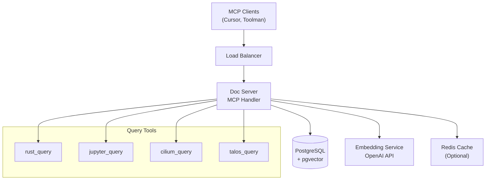

# Toolman Guide: Task 17 - Documentation and API Reference Generation

## Overview

This task creates comprehensive documentation including API reference, deployment guides, client integration examples, and architecture diagrams. The focus is on complete system documentation that enables successful deployment and integration.

## Core Tools

### Filesystem Server Tools

#### read_file

**Purpose**: Analyze existing code structure and extract documentation requirements
**When to Use**:

- Examine existing API implementations for documentation extraction
- Study current deployment configurations and procedures
- Review existing integration patterns and client usage
- Analyze system architecture and component relationships

#### write_file

**Purpose**: Create comprehensive documentation files and configuration
**When to Use**:

- Generate OpenAPI specification for MCP endpoints
- Create Kubernetes deployment guides and Helm charts
- Write client integration guides for Cursor and Toolman
- Add architecture documentation and performance guides

#### edit_file

**Purpose**: Enhance existing documentation and add missing information
**When to Use**:

- Add documentation comments to existing Rust code
- Update existing configuration files with documentation
- Enhance existing guides with additional examples
- Integrate documentation generation into build processes

### MCP Query Tools

All query tools serve as both documentation subjects and validation tools for the documentation being created.

#### rust_query

**Purpose**: Document and validate Rust-specific functionality
**When to Use**:

- Extracting examples for Rust API documentation
- Validating code examples in documentation
- Testing query functionality for documentation accuracy
- Generating realistic usage examples

#### jupyter_query, cilium_query, talos_query, meteora_query, raydium_query, ebpf_query, rust_best_practices_query

**Purpose**: Document comprehensive MCP tool usage across all domains
**When to Use**:

- Creating usage examples for each tool in client integration guides
- Validating tool functionality and response formats
- Testing query patterns for documentation examples
- Generating comprehensive API examples for OpenAPI specification

## Implementation Flow

### Phase 1: API Documentation Generation

1. Use `read_file` to analyze existing API implementations
2. Generate comprehensive Rust API documentation with cargo doc
3. Configure rustdoc settings for optimal documentation output
4. Validate documentation completeness and accuracy

### Phase 2: OpenAPI Specification Creation

1. Document all MCP HTTP endpoints and JSON-RPC methods
2. Define schemas for all tool inputs and outputs
3. Include authentication and protocol documentation
4. Validate specification with OpenAPI tools

### Phase 3: Deployment Documentation

1. Create comprehensive Kubernetes deployment guide
2. Document Helm chart creation and configuration
3. Add troubleshooting guides for common deployment issues
4. Include monitoring and operational procedures

### Phase 4: Client Integration Guides

1. Document MCP tool usage with detailed examples
2. Create Cursor IDE integration guide
3. Write Toolman client setup documentation
4. Add troubleshooting for client integration issues

### Phase 5: Architecture and Performance Documentation

1. Create system architecture diagrams with mermaid
2. Document data flow and component interactions
3. Write performance tuning guide with benchmarks
4. Add operational runbooks for production deployment

## Best Practices

### Documentation Quality

- Test all code examples for accuracy and completeness
- Use consistent formatting and style across all documents
- Include troubleshooting sections for common issues
- Provide step-by-step procedures with clear prerequisites

### API Documentation

- Document all public APIs with comprehensive examples
- Include error conditions and edge cases
- Use clear parameter descriptions and return value documentation
- Provide usage examples for complex functionality

### Deployment Guides

- Include complete configuration examples
- Document all required environment variables and secrets
- Provide troubleshooting for common deployment failures
- Include resource sizing and scaling recommendations

### Client Integration

- Provide complete setup procedures from scratch
- Include authentication and connection setup
- Document error handling and retry strategies
- Add performance optimization recommendations

## Task-Specific Implementation Guidelines

### 1. Cargo Doc Configuration

```toml
# Cargo.toml
[package.metadata.docs.rs]
all-features = true
rustdoc-args = [
    "--cfg", "docsrs",
    "--generate-link-to-definition",
    "--enable-index-page",
    "-Zunstable-options"
]

[dependencies]
# Ensure all features are documented
serde = { version = "1.0", features = ["derive"] }
```

### 2. OpenAPI Specification Structure

```yaml
# openapi.yaml
openapi: 3.0.0
info:
  title: Doc Server MCP API
  version: 1.0.0
  description: MCP-compatible documentation server API

paths:
  /mcp:
    post:
      summary: MCP JSON-RPC endpoint
      requestBody:
        required: true
        content:
          application/json:
            schema:
              $ref: "#/components/schemas/JSONRPCRequest"
      responses:
        "200":
          description: Successful response
          content:
            application/json:
              schema:
                $ref: "#/components/schemas/JSONRPCResponse"

components:
  schemas:
    JSONRPCRequest:
      type: object
      properties:
        jsonrpc:
          type: string
          enum: ["2.0"]
        method:
          type: string
          enum: ["tools/call", "tools/list"]
        params:
          type: object
        id:
          oneOf:
            - type: string
            - type: integer
      required: [jsonrpc, method, id]
```

### 3. Helm Chart Values Documentation

```yaml
# helm/doc-server/values.yaml
# Default values for doc-server
replicaCount: 2

image:
  repository: doc-server
  pullPolicy: IfNotPresent
  tag: "latest"

service:
  type: ClusterIP
  port: 8080

resources:
  limits:
    cpu: 2000m
    memory: 2Gi
  requests:
    cpu: 500m
    memory: 512Mi

autoscaling:
  enabled: true
  minReplicas: 2
  maxReplicas: 10
  targetCPUUtilizationPercentage: 70
  targetMemoryUtilizationPercentage: 80

database:
  host: postgresql
  port: 5432
  name: doc_server
  # Use existing secret for credentials
  existingSecret: postgresql-secret
```

### 4. Client Integration Example

```typescript
// Cursor IDE MCP Configuration
// .cursor/mcp_servers.json
{
  "mcpServers": {
    "doc-server": {
      "command": "node",
      "args": ["/path/to/mcp-client.js"],
      "env": {
        "DOC_SERVER_URL": "http://doc-server:8080",
        "MCP_API_KEY": "${DOC_SERVER_API_KEY}"
      }
    }
  }
}

// Example tool usage in Cursor
const response = await mcpClient.callTool('rust_query', {
  query: 'async fn examples',
  limit: 10
});
```

### 5. Architecture Diagram (Mermaid)



## Troubleshooting

### Documentation Generation Issues

#### Cargo Doc Failures

- Ensure all dependencies are available and up to date
- Check for missing documentation comments on public APIs
- Verify rustdoc configuration and feature flags
- Monitor build time and memory usage during generation

#### OpenAPI Validation Errors

- Use OpenAPI validation tools to check specification syntax
- Ensure all referenced schemas are properly defined
- Validate example requests and responses
- Check for circular references in schema definitions

#### Missing Documentation

- Audit public APIs for missing documentation
- Check for undocumented configuration options
- Validate example code for correctness
- Ensure troubleshooting sections are comprehensive

### Client Integration Issues

#### MCP Connection Problems

- Verify server accessibility and network configuration
- Check authentication credentials and headers
- Validate JSON-RPC message format
- Monitor connection timeouts and retry logic

#### Tool Usage Errors

- Ensure all tools are properly registered and available
- Check parameter validation and error messages
- Validate response format and schema compliance
- Test with various query patterns and edge cases

## Validation Steps

### Documentation Completeness

1. **API Coverage**: Verify all public APIs documented
2. **Example Testing**: Test all code examples for accuracy
3. **Link Validation**: Check all internal and external links
4. **Accessibility**: Validate documentation accessibility compliance

### Technical Accuracy

1. **OpenAPI Validation**: Use automated tools to validate specification
2. **Deployment Testing**: Follow deployment guide in clean environment
3. **Client Integration**: Test integration guides with actual clients
4. **Performance Validation**: Verify performance guide recommendations

### Quality Assurance

```bash
# Documentation generation
cargo doc --all-features --no-deps --open

# OpenAPI validation
swagger-codegen validate -i openapi.yaml
npx @apidevtools/swagger-cli validate openapi.yaml

# Helm validation
helm template helm/doc-server --validate
helm lint helm/doc-server

# Markdown validation
markdown-link-check docs/**/*.md
markdownlint docs/
```

## Success Indicators

- Complete Rust API documentation generated and hosted
- Valid OpenAPI specification enabling client code generation
- Successful Kubernetes deployment following documentation guide
- Functional client integration for Cursor and Toolman
- Comprehensive architecture documentation with clear diagrams
- Performance tuning guide enabling optimization
- Troubleshooting guides resolve 90%+ of common issues
- Documentation maintenance integrated into development workflow
